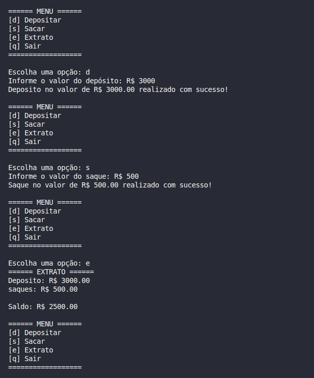

# 💸 Sistema Bancário Simples em Python

Este é um projeto simples de sistema bancário feito em Python feito juntamente com a plataforma da DIO com o Santander, ideal para quem está começando na programação e quer praticar lógica, condicionais e laços de repetição.

## 🔧 Funcionalidades

- **[d] Depositar:** Permite adicionar saldo à conta, desde que o valor seja positivo.
- **[s] Sacar:** Permite realizar saques com as seguintes regras:
  - Limite de **R$ 500,00** por saque
  - Máximo de **3 saques por dia**
  - Valor do saque deve ser positivo e não pode ultrapassar o saldo disponível
- **[e] Extrato:** Exibe todas as movimentações realizadas (depósitos e saques) e o saldo atual.
- **[q] Sair:** Encerra o programa com uma mensagem de agradecimento.

## ▶️ Como usar

1. Certifique-se de ter o Python instalado (versão 3.x).
2. Clone este repositório ou copie o código para um arquivo `.py`:
   ```bash
   git clone (https://github.com/laispimentel/criando-sistema-bancario.git)
Veja abaixo um exemplo do sistema em funcionamento:

